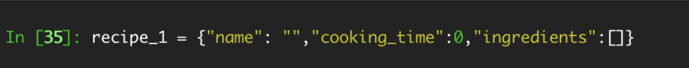
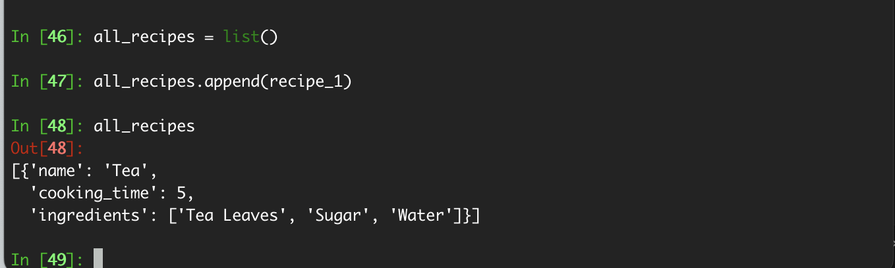
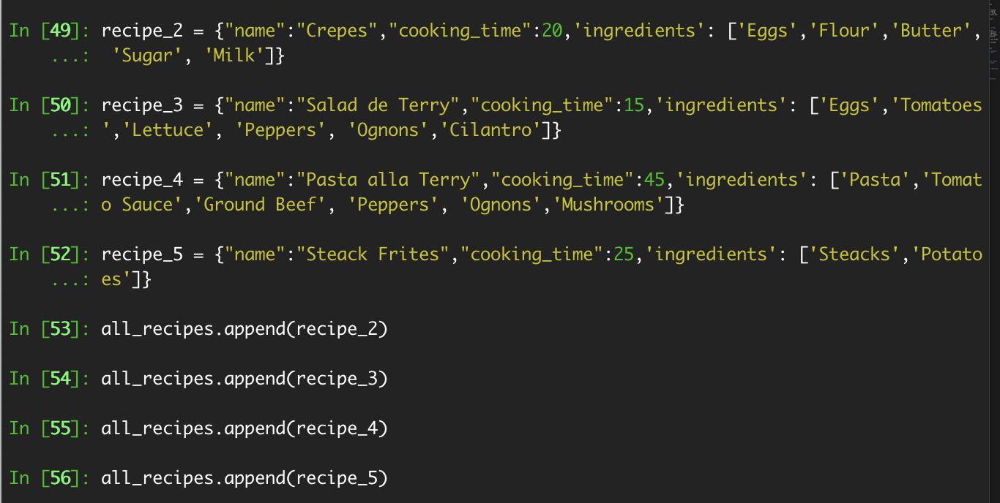
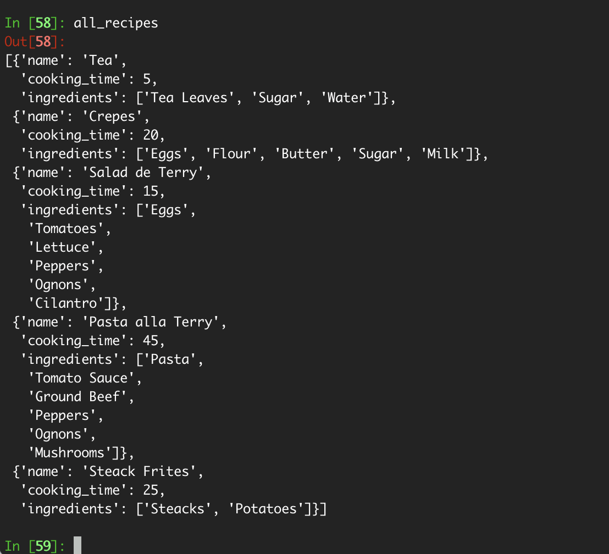
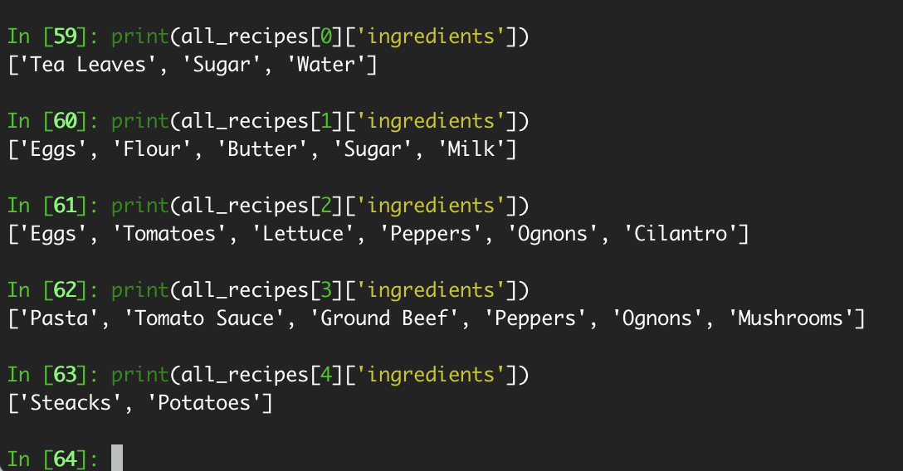

# Python-scripts Exercise 1.2

## step 1 - Create a structure named recipe_1 that contains the following keys:

- name (str): Contains the name of the recipe
- cooking_time (int): Contains the cooking time in minutes
- ingredients (list): Contains a number of ingredients, each of the str data type

Decide what data structure you would use for this purpose, and in your README file in the repository for this task, describe in approx. 50-75 words why you’ve chosen to use it.

- I have chosen to use a Dictionary as it makes the most amount of sense concidering that the object will allow to use combinations of key:value pairs which will match the requirements.
- I have created first an empty dictionary object

## step 2 - Set up a new virtual environment.

I have populated the values one by one, using the extend method on the 3rd element (which is a list). The extend method allowing to "Concatenate" 2 lists together. In my case the empty original list will be concatenated with the new provided list as the parameter of the method.

`recipe_1['ingredients'].extend(["Tea Leaves","Sugar","Water"])`

## step 3 - Create an outer structure called all_recipes

and then add recipe_1 to it. Figure out what type of structure you would consider for all_recipes, and briefly note down your justification in the README file. Ideally, this outer structure should be sequential in nature, where multiple recipes can be stored and modified as required.

- I created an empty list which will contain all the recipe objects.
- this list will be updatable (add/remove/update recipes)
- Sample code to add a recipe:
  `all_recipes.append(recipe_1)`

## step 4 - Generate 4 more recipes as recipe_2, recipe_3, recipe_4, and recipe_5, and then add them as well to all_recipes.

## step 5 - Once you’re done setting up all_recipes, print the ingredients of each recipe as five different lists, inside the IPython shell.

## step 6 - Add the following deliverables to the “Exercise 1.2” folder on your GitHub repo:

- Screenshots of each step (with suitable names)
- Updated learning journal
- README file

## step 7 - Submit the link to your GitHub repo here for review.

[Check my Journal here.](journal-1.2.pdf)
