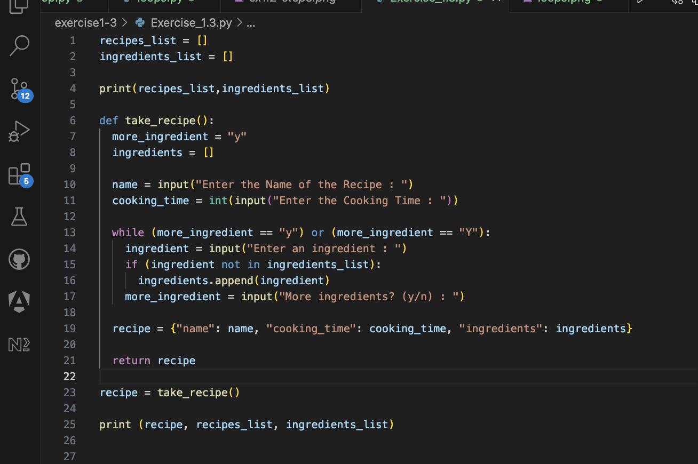
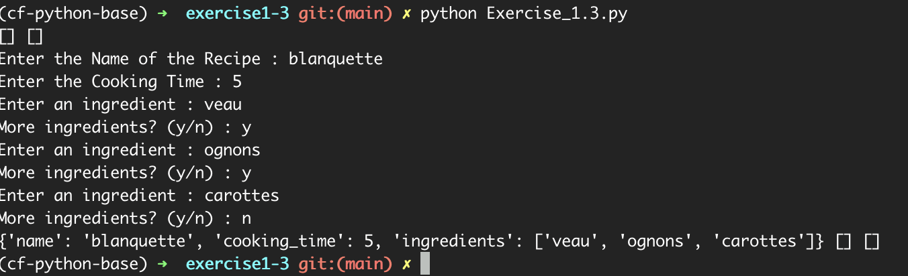
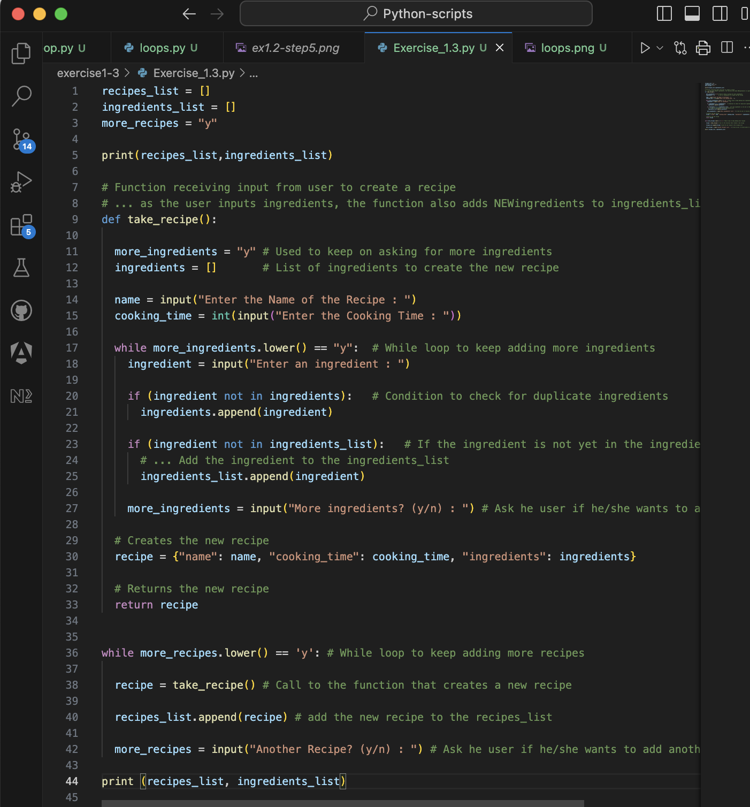
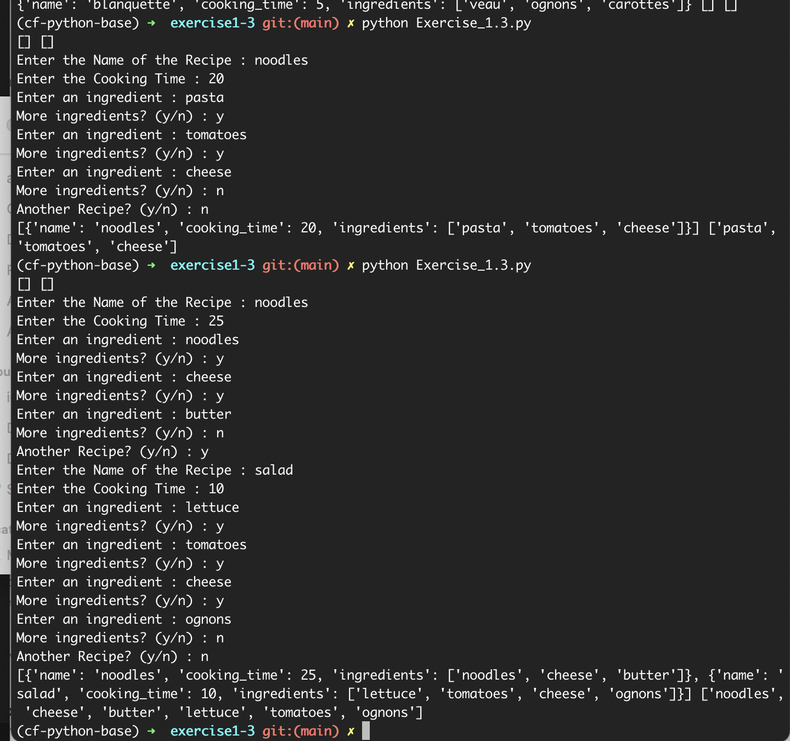
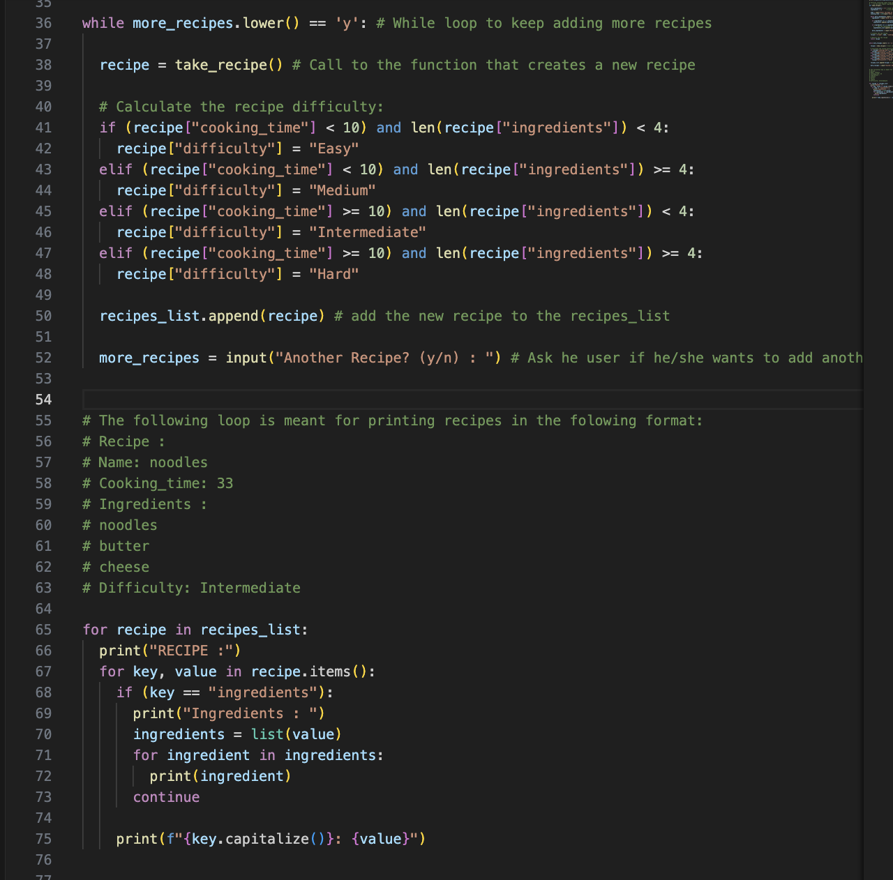
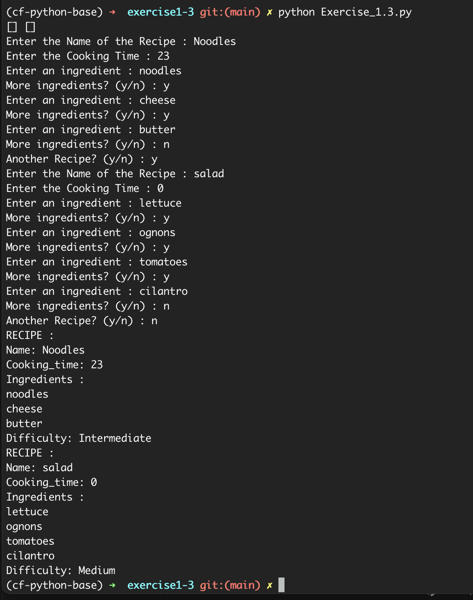
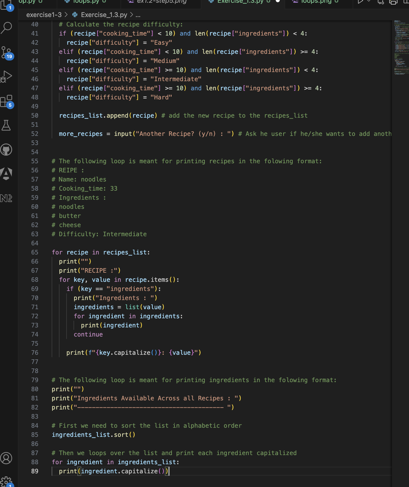
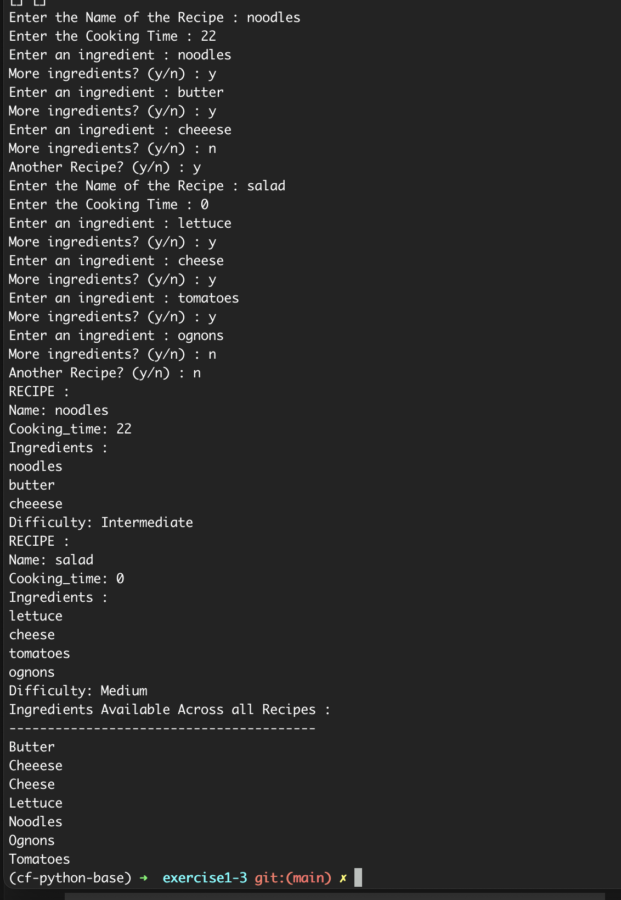

# Python-scripts Exercise 1.3

## CODE PRACTICE 1: IF-ELSE STATEMENTS:

- 1 Make a simple script that does addition and subtraction between two numbers.
- 2 The user gets to input three items: the first value, the second value, and then the operator + or -.
- 3 Based on the three inputs above, use if-elif-else statements to decide whether you’re going to perform addition or subtraction on the two values.
- 4 Use a final else statement to handle any unexpected operator. You could print a short error message like "Unknown operator".
- 5 Create a folder for this Exercise on your Github repo (you can name it “Exercise 1.3”). Create a sub folder inside this folder and name it “1.3-Practice Task 1” or something similar. Upload the screenshots you captured for the previous steps in this folder.

## CODE PRACTICE 2: FOR LOOPS

Using for loops, you can print the top three scores from a list of test scores. To practice what you’ve learned, complete the following steps and take screenshots of your IPython shell after each step:

- 1 Make a list of the following test scores and call it test_scores: 45, 23, 89, 78, 98, 55, 74, 87, 95, 75.
- 2 Sort test_scores in descending order with the sort() method for lists, using reverse=True as a parameter.
- 3 Just as you did in the previous example, print only the first three scores from this reverse sorted list.
- 4 Create a sub folder inside your “Exercise 1.3” folder and name it “1.3-Practice Task 2” or something similar. Upload the screenshots you captured for the previous steps in this folder.

## CODE PRACTICE 3: LOOPS

Let’s pause for a moment to recap loops with the help of another optional practice task. Take a look at the following code:

print(10)
print(20)
print(30)
print(40)
print(50)
print("And we're done!")

To practice what you’ve learned, complete the following steps and take screenshots of your Python shell after each step:

- 1 Rewrite the above code using a for loop.
- 2 Rewrite the code using a while loop.
- 3 Create a sub folder inside your “Exercise 1.3” folder and name it “1.3-Practice Task 3” or something similar. Upload the screenshots you captured for the previous steps in this folder.

## TASK: **DONE**

- 1 Open a Python script in an editor of your choice and name it “Exercise_1.3.py”. **DONE**

- 2 Initialize two empty lists: recipes_list and ingredients_list. **DONE**

- 3 Define a function called take_recipe, which takes input from the user for the following variables:
  name (str): Stores the name of the recipe.
  cooking_time (int): Stores the cooking time (in minutes).
  ingredients (list): A list that stores ingredients, each of the string data type.
  recipe (dictionary): Stores the name, cooking_time, and ingredients variables (e.g., recipe = {'name': name, 'cooking_time': cooking_time, 'ingredients': ingredients}). **DONE**

- 4 In the main section of your code, ask the user how many recipes they would like to enter. Their response will be linked to a variable n. **DONE a little bit differently as I made the loop conditional based on user input. This allows the user to enter as many Recipes as he wants.**

- 5 Run a for loop, which runs n times to perform the following steps:
  Run take_recipe() and store its return output (a dictionary) in a variable called recipe.
  Run another for loop inside this loop, which iterates through recipe’s ingredients list, where it picks out elements one-by-one as ingredient. It will run the following step inside: if the chosen ingredient isn’t present in ingredients_list, add it to this list. To check if an element ele is present in a sequence seq, you can use the in keyword in a conditional statement as follows: if ele in seq:. Either True or False is returned (remember that you’re checking if ingredient is not in the list, so use the not operator accordingly).
  Once you’ve finished adding ingredients, append recipe to recipes_list. **DONE**
  Here's the code :

`while more_recipes.lower() == 'y':     
    recipe = take_recipe() 
    recipes_list.append(recipe)
    more_recipes = input("Another Recipe? (y/n) : ")`

- 6 Run another for loop that iterates through recipes_list, picks out each element (a dictionary) as recipe, and performs the following steps:
  Determine the difficulty of the recipe using the following logic:
  If cooking_time is less than 10 minutes, and the number of ingredients is less than 4, set a variable called difficulty to the value of Easy.
  If cooking_time is less than 10 minutes, and the number of ingredients is greater than or equal to 4, set a variable called difficulty to the value of Medium.
  If cooking_time is greater than or equal to 10 minutes, and the number of ingredients is less than 4, set a variable called difficulty to the value of Intermediate.
  If cooking_time is greater than or equal to 10 minutes, and the number of ingredients is greater than or equal to 4, set a variable called difficulty to the value of Hard.
  Display the recipe in specified format. **DONE**

- 7 Next, you’ll have to display all the ingredients that you’ve come across so far in all of the recipes that you’ve just entered. In Step 5 you appended these ingredients into ingredient_list. Now it’s time to print them all out. Print them in alphabetical order. **DONE**

- 8 Upload the following deliverables to the “Exercise 1.3” folder on your GitHub repo:
  “Exercise_1.3.py” script
  Screenshots of each step (with suitable filenames)
  Updated learning journal
  **DONE**

[Check my Journal here.](./Copy%20of%20python-for-web-developers-learning-journal.txt)

- 9 Submit the link to your GitHub repo here for review. **DONE**
